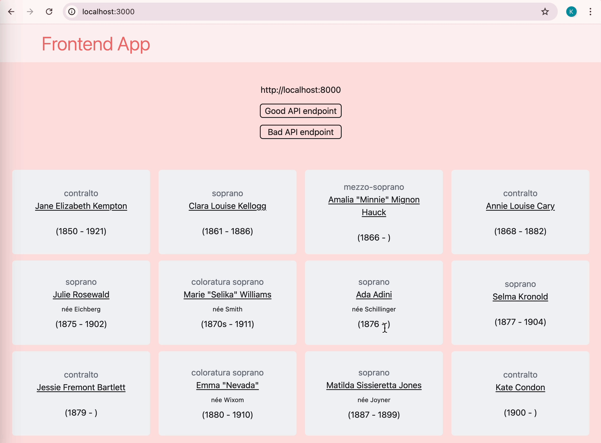

# Containerized Full-Stack Example

This is a basic example of how to structure and set up the docker files for a full-stack web application.
I modified this [tutorial](https://dev.to/fizy_hector/-containerizing-your-full-stack-node-app-using-docker-compose-4lnk), changing the frontend to Next.Js and changing the backend from Express in Node.js to FastAPI in Python.

In [`backend/`](./backend/), you'll build the FastAPI server.
For this example, the server has only one endpoint, 
which serves data about historic opera singers. 
The backend makes the data available through port `8000`.

```shell
fastapi run app/main.py --port 8000
```

In [`frontend/`](./frontend/), you'll build the TypeScript frontend that requests information from the backend (port `8000`) and renders it on the page.

```js
const url = 'http://localhost:8000';

const fetchData = async () => {
      // Start with loading and no errors
      setIsLoading(true);
      setError(false);
      // Try getting data from the API endpoint
      try {
        const result = await axios(url);
        setData(result.data);
      }
      // If there was a problem, set error to True
      catch (error) {
        setError(true);
      }
      // When finished, set loading to False
      setIsLoading(false);
    };
```

To demonstrate how the frontend fetches data
from the backend, I've displayed on the screen 
the API endpoint that the frontend is trying to access.
When the URI is correct (port `8000`), the 
data is displayed. But when the frontend is 
trying to access the backend through the wrong 
port (port `8001`), the error is caught and 
a message explaining the problem is shown.



## Build the container image

Install Docker Desktop, which should also install the `docker` CLI on your system.

To install and start the whole container (backend and frontend), use `docker`.

```console
$ docker compose up --build
[+] Running 0/0
[+] Running 0/2end   Building                                0.1s
 ⠙ Service backend   Building                                0.2s
[+] Building 160.8s (22/22) FINISHED                         docker:desktop-linux
```

## Run the containers

The easiest way to manage running and stopping the containers is with Docker Desktop.


## Develop the components

When developping the project, run the frontend and backend separately in their respective runtime environments.

### Backend

In a virtual Python environment, with the Python dependencies installed, run the command that's in the docker file.

```shell
fastapi run app/main.py --port 8000
```

See the [README](./backend/README.md).

### Frontend

Having already installed the node modules, run the command that's in the docker file.

```shell
npm run dev
```

See the [README](./frontend/README.md).
