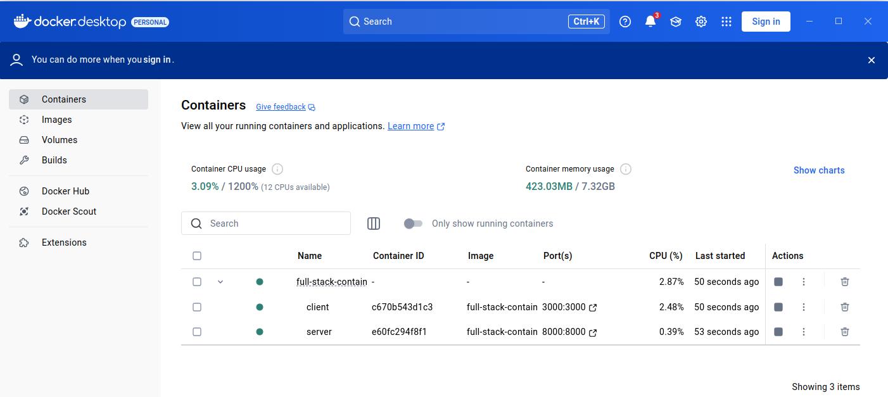

# Containerized Full-Stack Example

This is a basic example of how to structure
a (very simple) full-stack web application
and (more to the point) set up the docker
files to containerize it.

## Table of Contents
- [Explanation](#explanation)
- [Installation](#installation)
- [Usage](#usage)
  - [How to run Docker containers](#use-1-docker-containers)
  - [Code templates](#use-2-backend--frontend)
    - [Building backend with `FastAPI`](#backend)
    - [Building frontend with `React`](#frontend)
- [Contributing](#contributing)
- [License](#license)

## Explanation

Why would I use this example?

- You have data that you need people to be able to access. For the more technical users, you can simply set up an API (see [`backend/`](./backend/)), deploy it, and let the technical users call the API. For a more general audience, you'll want to set up a web interface (see [`frontend/`](./frontend/)) that communicates with your API based on user-friendly queries, page navigation, user input, etc. The latter requires both the backend and frontend, aka a "full-stack" web application.

- You need to deploy your full-stack web application from a remote server and/or you want people to be able to download it and create their own deployments. This is best managed with a "container," which builds all the necessary dependencies, environment variables, etc. for software written in any programming language into a convenient package. In this example, we use `Docker` to create these containers.

This example models 3 things:

1. A `FastAPI` [backend](./backend/) written in `Python`.

2. A `React` [frontend](./frontend/) written in `TypeScript` and using `NextJS`.

3. `Docker` files for building both ends and the whole, full-stack application.

    1. Backend blueprint: [`backend/Dockerfile`](./backend/Dockerfile)

    2. Frontend blueprint: [`frontend/Dockerfile`](./frontend/Dockerfile)

    3. Full-stack blueprint: [`docker-compose.yml`](./docker-compose.yml)


## Installation

### Step 1. Set up Docker

The easiest way to explore this example is to download and install [`Docker Desktop`](https://www.docker.com/products/docker-desktop/), which should also install `Docker Compose` as a command-line tool.

> [`Docker Compose`](https://github.com/docker/compose) is licensed under Apache-2.0 (open-source), and `Docker Desktop` is free to download and use. `Docker Desktop` allows you to login with a `Docker` account, but this is not necessary.

### Step 2. Download codebase

Download this example using `git clone`.

> If it's not already installed, first [download `git`](https://git-scm.com/book/en/v2/Getting-Started-Installing-Git).

```shell
git clone https://github.com/kat-kel/full-stack-container-example.git
```

### Step 3. Build the containers

To build the containers, you must satisfy 2 things:

1.  Make sure that `docker` is running. If you're using `Docker Desktop`, simply open the application. If `docker` is not running, you'll see the following error message when trying to build and/or run the container:

```console
$ docker compose up --build
unable to get image 'full-stack-container-example-frontend':
Cannot connect to the Docker daemon at unix:///home/user/.docker/desktop/docker.sock.
Is the docker daemon running?
```

2. Have your command line located at the root of this codebase, aka where the `docker-compose.yml` file is.

Finally, build and begin running the full-stack app's container using `Docker Compose`.

```console
$ docker compose up --build
[+] Running 0/0
[+] Running 0/2tend  Building                                                   0.1s
 ⠹ Service frontend  Building                                                   0.3s
[+] Building 60.7s (22/22) FINISHED                             docker:desktop-linux
...
 ✔ Service frontend                              Built                         60.8s
 ✔ Service backend                               Built                          2.1s
 ✔ Network full-stack-container-example_default  Created                        0.1s
 ✔ Container client                              Created                        1.1s
 ✔ Container server                              Created                        1.1s
Attaching to client, server
client  |
client  | > frontend@0.1.0 dev
client  | > next dev
client  |
server  |
server  |    FastAPI   Starting production server
```

> It's normal for the build process to take serveral minutes. This example isn't designed to also show how to optimise Docker build times.

## Usage

This example serves 2 main uses:

1. Running and stopping `Docker` containers.

2. Templates for a simple backend REST API and a simple React frontend.

### Use 1: Docker containers

`Docker Desktop` is the easiest way to manage running and stopping the built containers.




Alternatively, can run both containers (client, server) from the root of the repository (where `docker-compose.yml` is) with the command `docker compose up` in the terminal.

```console
$ docker compose up
[+] Running 2/0
 ✔ Container server  Created                                                    0.0s
 ✔ Container client  Created                                                    0.0s
Attaching to client, server
client  |
client  | > frontend@0.1.0 dev
client  | > next dev
client  |
server  |
server  |    FastAPI   Starting production server
```

In the same terminal from which you started the containers with `docker compose up`, stop both of them by pressing `Ctrl` and `C` together.

```console
Gracefully stopping... (press Ctrl+C again to force)
[+] Stopping 2/2
 ✔ Container server  Stopped                                                    0.4s
 ✔ Container client  Stopped                                                   10.2s
```

### Use 2: Backend / Frontend

#### Backend

[Go to backend.](./backend/)

The backend's REST API is built with [`FastAPI`](https://fastapi.tiangolo.com/) in `Python`.

To begin developping the template and adding your own [endpoints](https://fastapi.tiangolo.com/tutorial/path-params/), data sources, etc., you'll first need to set up a virtual `Python` environment using version 3.12 or greater. Then, install the backend as a package with `pip install -e .`.

For developping purposes, run the backend separately in your virtual environment. From inside the `backend/` directory, run the following command:

```console
$ fastapi dev src/api/main.py --port 8000

   FastAPI   Starting development server 🚀

             Searching for package file structure from directories with __init__.py
             files
             Importing from
             /home/user/Dev/full-stack-container-example/backend/src

    module   📁 api
             ├── 🐍 __init__.py
             └── 🐍 main.py

      code   Importing the FastAPI app object from the module with the following
             code:

             from api.main import app

       app   Using import string: api.main:app

    server   Server started at http://127.0.0.1:8000
    server   Documentation at http://127.0.0.1:8000/docs
```

By running your backend app with the development server (`fastapi dev`), changes you make and save in the Python modules ([`src/api/`](./backend/src/api/)) will be applied as the application automatically reloads.

#### Frontend

[Go to frontend.](./frontend/)

##### Installation

The frontend is built in [`React`](https://react.dev/) with a [`Next.js`](https://nextjs.org/) framework.

To begin developping the components, first install the `Node` modules. Contrary to Python, you don't need a virtual environment to do this because they're installed locally in the `fontend/` directory.

In order to install the modules, you must have the following installed globally on your system:

1. [`Node.js`](https://nodejs.org/en), version 20 or greater.

2. [`npm`](https://docs.npmjs.com/downloading-and-installing-node-js-and-npm?ref=meilisearch-blog), version 10 or greater.

> Note: The beauty of containers / Docker is that all this stuff about packages and dependencies is handled for you! But for actually developping the thing you'll containerize, you'll need to set things up yourself.

Finally, from inside the [`frontend`](./frontend/) directory, where the [`package.json`](./frontend/package.json) file is, install the frontend's `node` modules with the following command:

```shell
$ npm install
```

##### Development

This frontend template was built with the [`Next.js`](https://nextjs.org/) framework, specifically using `App Router`. [Read here](https://nextjs.org/docs/app/getting-started/project-structure) about how to structure and develop a project with this architecture.

## Contributing

This example is meant to remain light-weight and minimal, showcasing primarily `Docker Compose`, `FastAPI`, and `React`. For this reason, please don't contribute enhancements that add complexity to the example.

However, if you are installing the example and discover an error on your machine, please open an issue that describes your set-up and the problem. I also welcome your input on how to make more explicit, standardised, and/or cleaner the code in the frontend and backend.

## License

This project is licensed under the [MIT License](./LICENSE).
