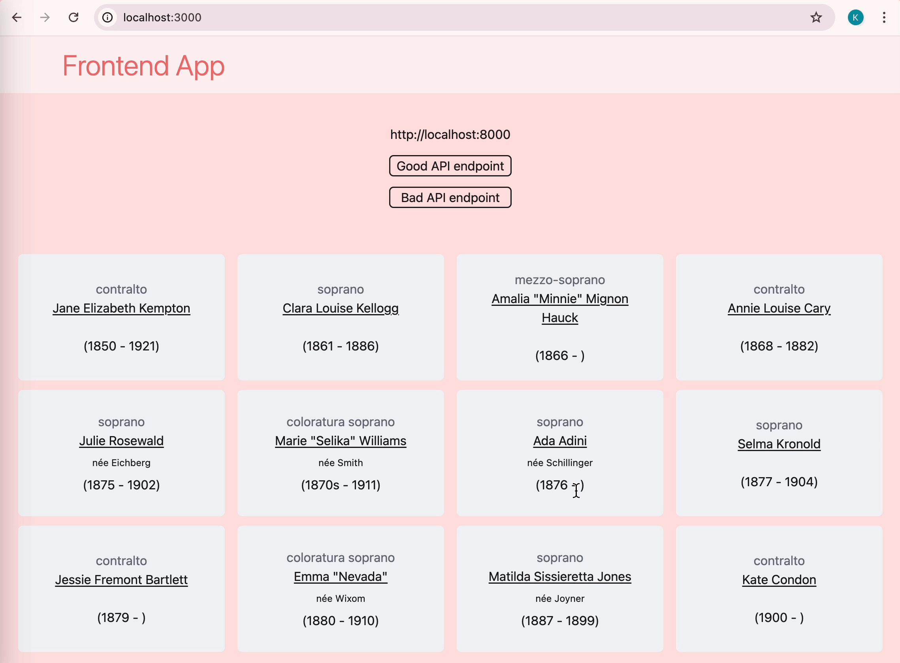

# Frontend

This template comes with only one route: `http://localhost:3000/`, aka the index or home page.

## Table of Contents

- [Explanation](#explanation)
- [Installation](#installation)
- [Run client](#run)
- [Testing](#testing)
- [Linting](#linting)

## Explanation

When the page loads, it tries to load data from the API template's only endpoint, `http://localhost:8000/`. If you're running this frontend while also running the backend, the page should load correctly and you should see the data rendered in a grid.

To demonstrate how this template is requesting data from the backend, and what happens if there's a problem, you can change the URI to make it incorrect, i.e. `http://localhost:8001/`. Thanks to a `useEffect` hook, which is fetching the data, the changed URI is detected, the page is reloaded, and you can observe how this template handles the error.




## Installation

Install the node modules with `npm i`.

```console
$ npm i

added 518 packages, and audited 519 packages in 43s

168 packages are looking for funding
  run `npm fund` for details

found 0 vulnerabilities
```

## Run

1. Make sure the backend Python API is running.

2. Run the frontend with `npm run dev`.

```console
$ npm run dev

> frontend@0.1.0 dev
> next dev

   ▲ Next.js 15.2.2
   - Local:        http://localhost:3000
   - Network:      http://192.168.1.83:3000

 ✓ Starting...
 ✓ Ready in 1323ms
```

## Testing

```console
$ npm run test

> frontend@0.1.0 test
> vitest


 DEV  v3.0.9 /home/user/Dev/full-stack-container-example/frontend

 ✓ src/__tests__/components/singers.test.tsx (1 test) 92ms
   ✓ Render singer metadata card

 Test Files  1 passed (1)
      Tests  1 passed (1)
   Start at  19:48:35
   Duration  244ms

 PASS  Waiting for file changes...
       press h to show help, press q to quit
```

## Linting

Use ESLint to check for syntactic warnings or errors.

```console
$ npm run lint

> frontend@0.1.0 lint
> next lint

✔ No ESLint warnings or errors
```
